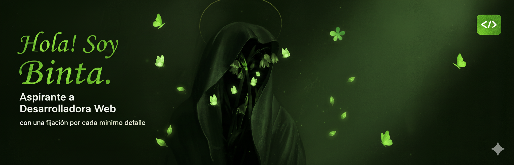

  
# Bienvenid@, &lt;dev/&gt; 👋🏾</h1>

### Aprendiz de desarrollo y estética web</h3>

Estudiante de Segundo Ciclo de Desarrollo de Aplicaciones Web en IES Playamar.
    
Mi viaje adentrándome al mundo de la informática dió comienzo en 2022, en grado medio. Desde ese  momento,  
he absorbido conocimiento de profesores, cursos, contenido de desarrolladores de alto perfil, e incontables  
"prácticas al fallo". Actualmente, continúo aprendiendo nuevas habilidades y  tecnologías para mantenerme  
a la última en este sector de rápido crecimiento y constante innovación.  

 

## 🧕🏾 Sobre Mí
  - Entusiasta del diseño y la estética 🎨
  - Cerebro inquieto siempre en busca de conocimiento 🧠
  - I ❤ Databases
  - Coleccionadora de cursos y certificados 🎓

 
  
  ## 💻 Lenguajes y Tecnologías</h2>
  ### 💡 Conocidas y Trabajadas
  

  
  ### ⚙️ En Proceso de Aprendizaje
  

> NOTA: Especialmente me apasiona el frontend  
> En un futuro (no tan lejano, espero), planeo especializarme en el desarrollo del lado cliente

 

  
  ## 📊 Mis Estadísticas

  
  
  

 

## 💭 Estoy siempre dispuesta a...
  - Poner a prueba mi pensamiento lógico con diferentes retos de programación
  - Pulir y perfeccionar la funcionalidad, estructura y visibilidad de mis proyectos
  - Recibir críticas constructivas y sugerencias para mejorar mi estilo de trabajo
  - Conectar con miembros de la comunidad de los que adquirir nuevas habilidades

 
 

  
  ## ¿Nos echamos unas risas? 😆
  Reírse aumenta el oxígeno en el cuerpo, y reduce el estrés y el dolor  
  Tómate un descanso de los bugs con un poco de humor informático ;)

  
  

<h3 align="center">･  ･  ･  ･  ๑ ✿ ๑  ･  ･  ･  ･</h3>

  
  ### ¿Te has quedado con ganas de más?
  Acompáñame en este viaje de crecimiento y lleno de  
  oportunidades por descubrir pasándote por <a href="https://github.com/bintidev?tab=repositories" alt="Mi perfil">aquí</a> <3
  
  
  

